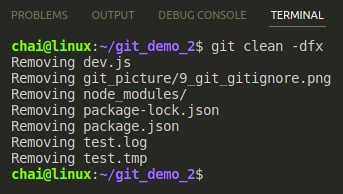
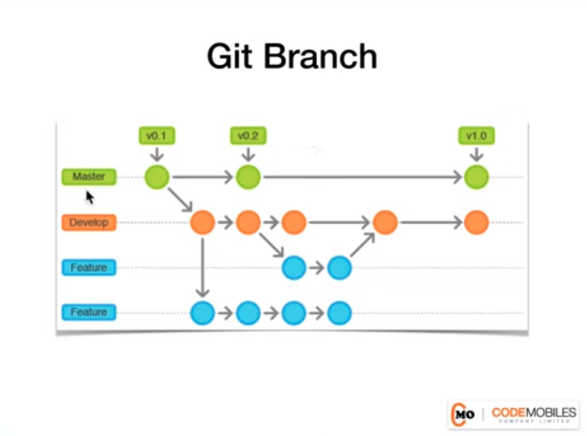
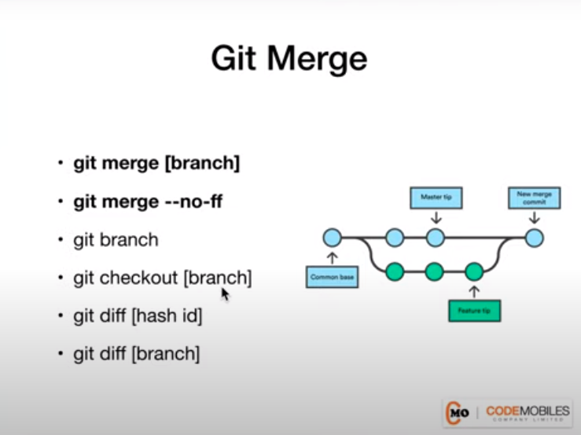
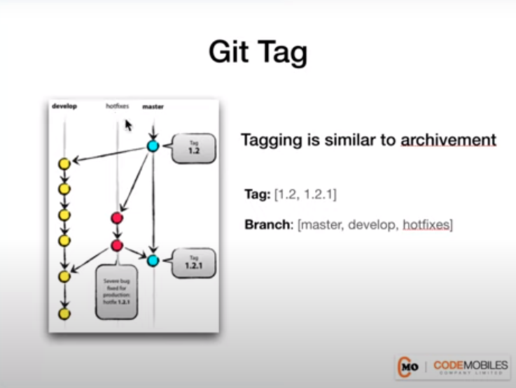

# gitdemo

```
$ echo "# git_demo" >> README.md
$ git init
$ git add README.md
$ git commit -m "first commit"
$ git branch -M main
$ git remote add origin https://github.com/YuttanaSRMUTT/git_demo_2.git
$ git push -u origin main
```
# __ตอนนี้เครื่องเราทำได้ (VSCODE)__
```
$ git add .
$ git status
$ git commit -m "2nd"
$ git push 
```
# __ตอนนี้เครื่องเราก็ทำได้ (VSCODE)__
```
$ git commit -a -m "3rd"
$ git push 
```


# git configuration

## Show the configuration
```
$ git config --global --list
$ git config --list
```

## Set git username and email globally
```
$ git config --global --list
$ git config --global user.name "YuttanaS"
$ git config --global user.email "yuttana.s.rmutt@gmail.com"
```

## Git Ignored
* สร้าง Files [.gitignore](https://github.com/github/gitignore)
* เพิ่มนามสกุล File ที่เราจะไม่สนใจ Upload
* *.log คือชื่อ Files
* bin/ คือชื่อ Folder
* add files .gitignore เข้าไปใน directory
* ```$ git add . ```
* ```$ git commit -a -m "4th" ```


## ทดสอบการใช้ gitignore 
```
$ npm init -y
$ npm i express
```
* program npm จะ Downlosd node_modules เข้ามาใน Directory ซึ่งจะเป็น Directory ที่เราจะทดสอบ
* ขั้นตอนการ Clean data ที่ไม่ต้องการใข้งานให้พิมพ์ ระบบ git จะทำการลบ files หรือ folder ที่ระบุไว้ใน `.gitignore`

``` 
$ git clean -dfx
```


### git push ansd pull


### git Merge Conflict
```
```

### git Branch


* List all branches
    ``` 
    $ git branch 
    ```
* Create branch
    ```
    $ git branch [branch-name]
    ```
* Switch branch
    ```
    git checkout [branch-name]
    ```
* Create and switch branch
    ```
    git checkout -b [branch-name]
    ```
* Delete branch
    ```
    git branch -d [branch-name]
    ```

```
$ git branch
$ git branch [branch-name]
$ git checkout [branch-name]
$ git checkout -b [branch-name]
$ git branch -d [branch-name]
$ git branch -D [branch-name]

```


#### Merge Branch


```
$ git merge feature
```

### git tag


